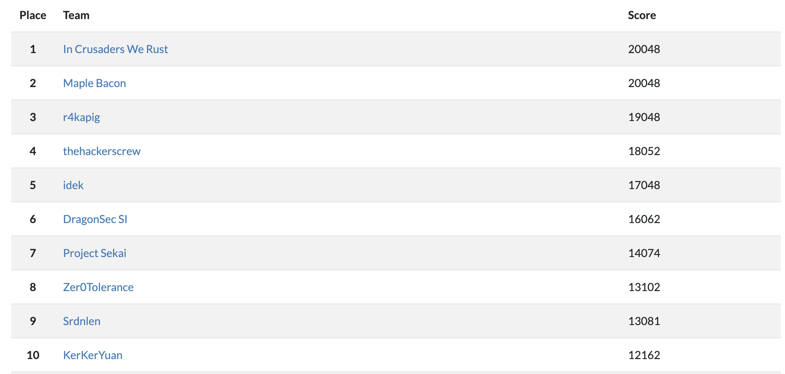
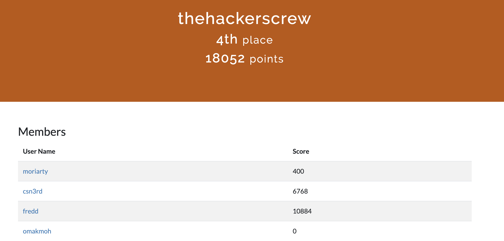
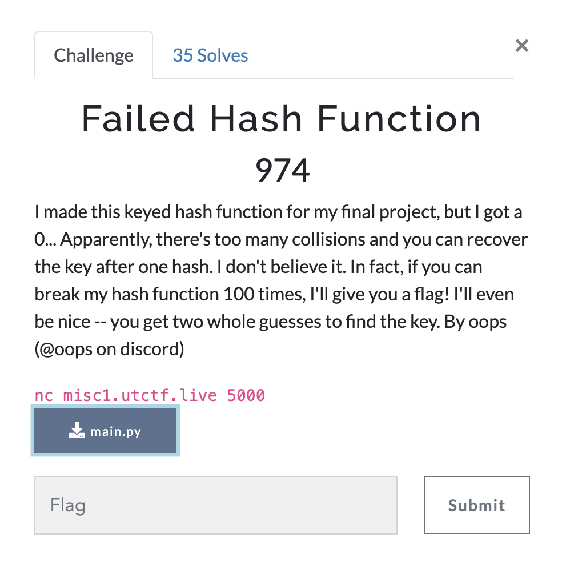
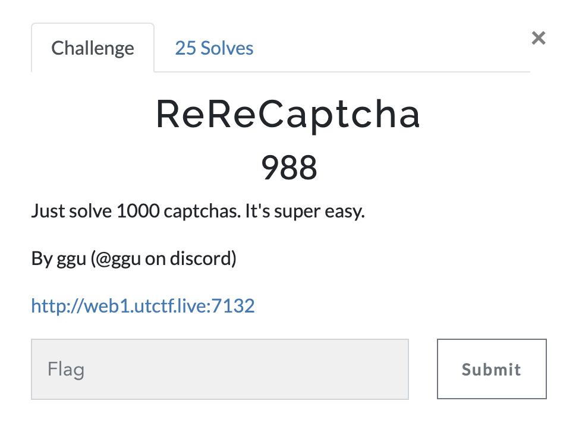

# UTCTF Writeups
## By CSN3RD

UTCTF Final leaderboard:

I competed with TheHackersCrew and we placed 4th out of 560 teams. By the end, we only had 2 touch challenges left.

Here are my writeups for 3 interesting challenges from UTCTF.
1. [Failed-Hash-Function (Crypto)](#Failed-Hash-Function)
2. [ReReCaptcha (Web)](#ReReCaptcha)
3. [UTCTF Adventure ROM 4 (Rev)](#UTCTF-Adventure-ROM-4)

## Failed Hash Function

[Attachment - Main.py](main.py)

### Solution
This challenge requires us to break a hash function 100 times in a row. Looking inside the python file, the hash function works by looping over every pair of bytes in the input. For each pair (x,y), the hash function computes the xor of x with k1, the xor of the y with k2, and the product of the two xors. Finally, the number of trailing zeroes in its binary representation is counted and printed.

First, the number of trailing zeroes of a product is equivalent to the sum of the number of trailing zeroes in the multiplier and multiplicand.

Second, the value of xor is 0 for a bit when the two input bits are 0. Thus, the number of trailing zeroes off an xor is equivalent to the number of common trailing bits.

Hence, we can use the first input to brute force the lower 4 bits of k1 and k2. To do this, we can send the string "0123456789:;<=>?", where each byte covers one of 16 possibilities.

Combining the two facts from earlier, if we analyze the output as a 16 by 16 grid, the raw count at (row i, column j) represents common_trailing_bits(k1, input_byte[i]) + common_trailing_bits(k2, input_byte[j]). Since we have all possible input bytes, that means that the minimum count at row i is the number of common trailing bits of k1 and input_byte[i]. The minimum count at column j is the number of common trailing bits of k2 and input_byte[j].

As a result, one input byte will share at least 4 common trailing bits with k1 and one input byte will share at least 4 common trailing bits with k2.

The second input can be used to brute force the rest of k1 and k2. Since, we need to brute force over both k1 and k2, we will split our input string in half. The first 8 bytes we send will cover one of 8 possibilities for k1 and the last 8 bytes will cover one of the 8 possibilities for k2.

This means that we can get the next 3 bits of k1 and k2 using the same method as was used for getting the bottom 4 bits. However, it is important to realize that the search space is narrowed down from a 16 by 16 grid to an 8 by 8 grid. This is because 8 columns represent the bytes for k1 and 8 columns represent the bytes for k2.

Finally, our brute force only guarantees 7 bits of each key. We get all 8 bits of a key if its most significant bit is a 0. So, the last step is to check if we need to set the msb for either key to a 1.

After we repeat this hash-cracking process 100 times, we receive the flag.

[Solution Script](failhash.py)

[Solution Ouput](failhashfunction_out.txt)

Flag: `utflag{Ju5t_u53_SHA256_LoLc4t5_9a114be7f}`

## ReReCaptcha

