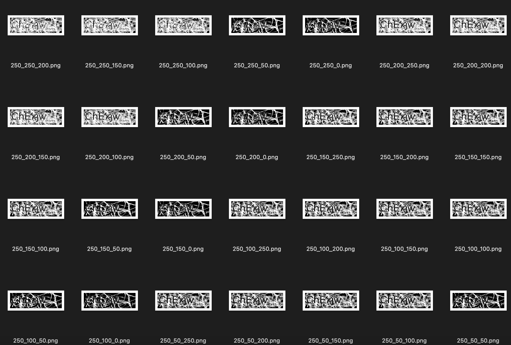
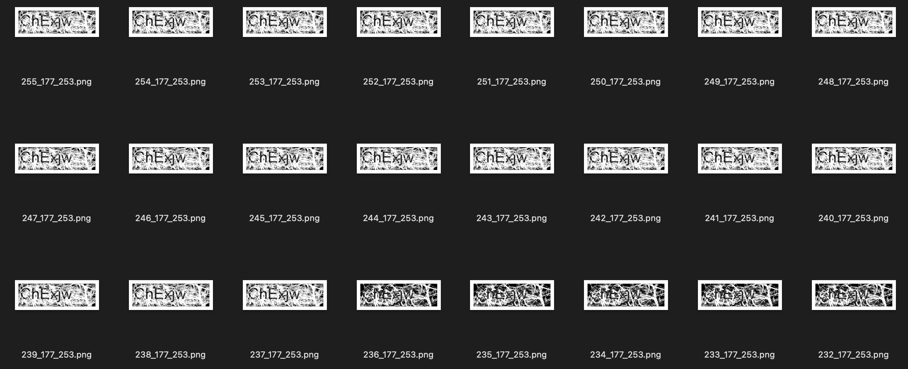
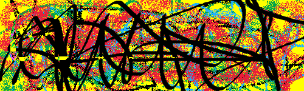
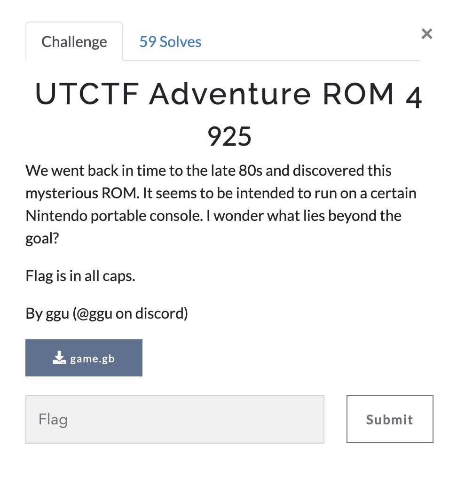
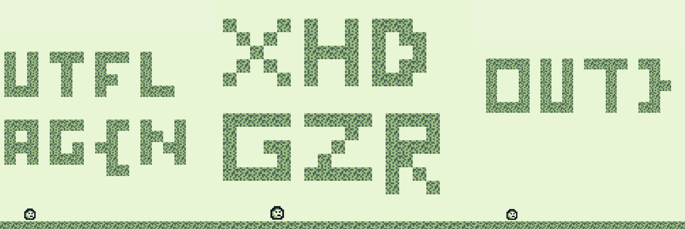

# UTCTF Writeups
## By CSN3RD

UTCTF Final leaderboard:

I competed with TheHackersCrew and we placed 4th out of 560 teams. By the end, we only had 2 challenges left.

Here are my writeups for 3 interesting challenges from UTCTF.
1. [Failed-Hash-Function (Crypto)](#failed-hash-function)
2. [ReReCaptcha (Web)](#rerecaptcha)
3. [UTCTF Adventure ROM 4 (Rev)](#utctf-adventure-rom-4)

## Failed Hash Function

[Attachment - Main.py](main.py)

### Solution
This challenge requires us to break a hash function 100 times in a row. Looking inside the python file, the hash function works by looping over every pair of bytes in the input. For each pair (x,y), the hash function computes the xor of x with k1, the xor of the y with k2, and the product of the two xors. Finally, the number of trailing zeroes in its binary representation is counted and printed.

First, the number of trailing zeroes of a product is equivalent to the sum of the number of trailing zeroes in the multiplier and multiplicand.

Second, the value of xor is 0 for a bit when the two input bits are 0. Thus, the number of trailing zeroes off an xor is equivalent to the number of common trailing bits.

Hence, we can use the first input to brute force the lower 4 bits of k1 and k2. To do this, we can send the string "0123456789:;<=>?", where each byte covers one of 16 possibilities.

Combining the two facts from earlier, if we analyze the output as a 16 by 16 grid, the raw count at (row i, column j) represents common_trailing_bits(k1, input_byte[i]) + common_trailing_bits(k2, input_byte[j]). Since we have all possible input bytes, that means that the minimum count at row i is the number of common trailing bits of k1 and input_byte[i]. The minimum count at column j is the number of common trailing bits of k2 and input_byte[j].

As a result, one input byte will share at least 4 common trailing bits with k1 and one input byte will share at least 4 common trailing bits with k2.

The second input can be used to brute force the rest of k1 and k2. Since, we need to brute force over both k1 and k2, we will split our input string in half. The first 8 bytes we send will cover one of 8 possibilities for k1 and the last 8 bytes will cover one of the 8 possibilities for k2.

This means that we can get the next 3 bits of k1 and k2 using the same method as was used for getting the bottom 4 bits. However, it is important to realize that the search space is narrowed down from a 16 by 16 grid to an 8 by 8 grid. This is because 8 columns represent the bytes for k1 and 8 columns represent the bytes for k2.

Finally, our brute force only guarantees 7 bits of each key. We get all 8 bits of a key if its most significant bit is a 0. So, the last step is to check if we need to set the msb for either key to a 1.

After we repeat this hash-cracking process 100 times, we receive the flag.

[Solution Script - failhash.py](failhash.py)

[Solution Ouput - keys and flags](failhashfunction_out.txt)

Flag: `utflag{Ju5t_u53_SHA256_LoLc4t5_9a114be7f}`

## ReReCaptcha

### Solution
This challenge requires us to solve 1,000 captchas in a row. Since this challenge was in the web category, I looked into the source code to see if there was anything to exploit. Unfortunately, there didn't seem to be anything vulnerable.

One thing I did notice was that there was a session cookie. After playing around with the cookies, I realized that the cookie represents a captcha image and the number of solved captchas in that session.

This means that if we mess up on a captcha, we can revert our session cookie to one that was working before. Essentially, this restores our progress in the case of any mistakes so we don't have to restart from 0.

Next, we need to figure out how to solve the captchas. Looking at the captchas, the characters all seemed to fit a standard font and size, so OCR libraries such as OpenCv or Python-tesseract should be able to read them. All we need is one line of code - `pytesseract.image_to_string(captcha, config='--oem 1 --psm 13')`. In our config parameter, we specify OEM 1 - neural net engine model and PSM 13 - one line of raw text.

However, there is too much color and noise in the captchas and the text is unrecognizable. So, we need to find a way to filter them out.

The first method I tried was to play around with different RGB thresholds.

This didn't work and the captchas could not get clean enough for any OCR programs to reliably read.

After putting the problem aside, one of my teammates realized that the background of each captcha was the same each time. This means that if we have the original background image, we can take the difference / xor of our captcha to get a clean image.

We were not able to find the original background with Google and other reverse image searches. As an alternative, we tried to get the original image by taking tons of captchas and finding the most common pixel at each position.

Result:

This worked somewhat well. When tested on our captcha training set, pytesseract was successful around a third of the time.

After taking a deeper look at the images after taking the xor, we found that some pixels were flipped. We manually patched some of these areas in our code to get cleaner results. This boosted the performance on our training set to around 90%.

Finally, we run our code on the actual challenge deployment. We send a GET request to get a captcha and we send a POST request to submit the solution. We keep track of best scores and their corresponding cookies. Anytime our captcha recognition code fails, we can backtrack and progress with a new captcha. Overall, it took around 80 minutes for my code to successfully solve 1,000 captches.

[Solution Script - rerecaptcha.py](rerecaptcha.py)

[Solution Output - list of cookies](captcha_cookies.txt)

Once we get the last cookie corresponding to 1,000 solves, we can send a GET request to get the flag.

Flag: `utflag{skibidi_bop_mm_dada_uLG7Jrd5hP}`

## UTCTF Adventure ROM 4

### Solution

In this challenge, we are given a GameBoy ROM. One of my teammates found a great emulator and debugger called [BGB](https://bgb.bircd.org/#downloads). 

The key is to see the map using the VRAM viewer and notice that there is more beyond the wall. We can use the cheat searcher to figure out which memory addresses store the location of our sprite. Once we find those 4 addresses, we can edit them using the cheat engine to get past the walls and read the flag. 

[Solution Video - Youtube](https://youtu.be/MjbcB86Mpw4)

Flag: 

Flag: `utflag{NXHDGZROUT}`
